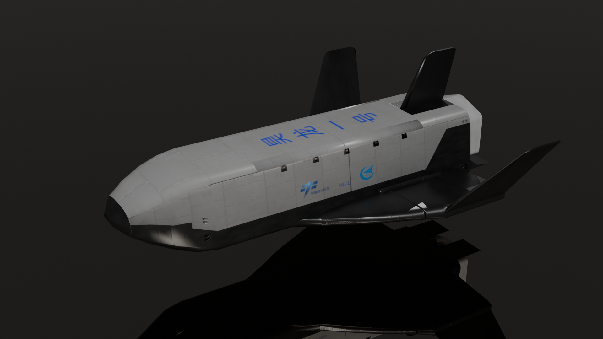

# HaolongModeling
A opensource Haolong cargo shuttle model for KSP modders

## What is Haolong?
Haolong(昊龙) is a cargo space shuttle used to transmit payloads from/to Tiangon Space Station. More details can be found at https://sat.huijiwiki.com/wiki/%E6%98%8A%E9%BE%99%E8%B4%A7%E8%BF%90%E8%88%AA%E5%A4%A9%E9%A3%9E%E6%9C%BA

Basic Parameters:
| Length | Width(expanded) | Weight |
|---|---|---|
| 10m | 8m | 6t |

## Model Description
Model is built with Blender, and parts are splited by GameObject entries.

## External Resources Used
| Object | Source |
|---|---|
| Solar Panel Texture | texture.com free item |
| Hub White Panel | texture.com free item |
| Thermal texture | KSP Squad thermal part texture |
| Gear mesh and texture | KSP Squad gear assets, without fairings |
| Dockport as reference | KIU Proactive Docker Asset |

## Why I release this model?
I'v been playing KSP for 8 years, and got many supports as well as beautiful mods from community, it's time to do some contribution. However, the project takes more efforts and time than I was expected, but I have to focus on my full time work.

## What to do?
After several attempts to import model into KSP, I found some issues about materials and textures. I will redo texturing in the following days. 

The major workload will be adding lots of anchor points and collidar meshes following the requirements of KSP animations, also, write many lines of KSP configs to adapt legacy game and RO/FAR envs. 

## How to contribute
You can submit pull requests, or completely clone the repo and do you own work independently. Feel free to mention me if you finally complete the mod. If you or your team decide to push forward the project, I am happy to help.

## Demo of model

